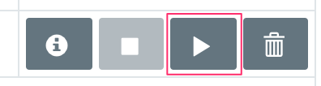

# Spring Cloud Dataflow Demo

There are two supported ways to run this demo: in a hosted environment, or in your own environment.

* **Hosted**. The Spring Cloud Data Flow Demo can be run in the org **group-S1P-SCDFdemo** on PCFOne (If you need the credentials for these environments, contact Corby Page or Phil Berman).
* **Your own environment**. This demo comes with a concourse pipeline for installing demo assets (SCDF service instance + Bubble Charts + Apps in SCDF)onto your own PCF environment. Instructions for this pipeline are found [here](tree/master/ci)

The instructions below will assume your are running in the hosted **group-S1P-SCDFdemo** environment, but they are easily adapted to use the URLs, org, and space for whatever environment you choose.

# Prerequisites

1. Install the Spring Cloud Dataflow Shell on your local machine (if you plan on using shell to define apps and streams, however we will be using graphical editor to define apps & stream as part of this demo). You can download the 1.6.2 version of the shell here: http://repo.spring.io/release/org/springframework/cloud/spring-cloud-dataflow-shell/1.6.2.RELEASE/spring-cloud-dataflow-shell-1.6.2.RELEASE.jar

   You can run the shell with `java -jar spring-cloud-dataflow-shell-1.6.2.RELEASE.jar`

2. Obtain your Twitter API credentials, if you don't already have them. You can generate these credentials at https://dev.twitter.com

The credentials you will need for this demo are:
* **Consumer Key**
* **Consumer Secret**
* **Access Token**
* **Access Token Secret**

# Deploy the Base Stream

Navigate to the **S1P-SCDFDemo** space in the demo environment. If the stream has not been deployed, you will see one app stopped:

---

To access the Spring Cloud DataFlow dashboard, goto Services tab and click on DataFlow Server service instance and then, click on Manage:

---

This displays all the available apps - streams and batch tasks if they have already been imported. If not, click on Import Applications and bulk import apps by using the links below.

For stream apps: http://bit.ly/Celsius-SR3-stream-applications-rabbit-maven
For batch tasks: http://bit.ly/Clark-GA-task-applications-maven

Go back to the main screen and import 2 additional apps (nlp and redis) using the links below:

NLP: https://s3.amazonaws.com/maven-shgupta/nlp-processor-0.0.1-SNAPSHOT.jar

Redis: https://s3.amazonaws.com/maven-shgupta/redis-sink-0.0.1-SNAPSHOT.jar

---

We will use graphical editor to demo the creation and deployment of streams but you can also use Spring Cloud DataFlow Shell . Click on the Streams in the header nav at the top of the screen, and then click on the "Create Stream" navtab next to Definitions:

Now you can show how to visually compose a stream by wiring the twitterstream source, to the transform processor, to the log sink. When you are done, clicking the layout button will give a clearer view:

When you click on each app in the stream, you will see a gear icon in the lower left, and an X icon in the lower right. Clicking on the gear icon will allow you to set the properties for the app. In the Twitterstream app, enter your credentials for the app properties:

Also enter *tweets* for the Stream Name, and *en* for the Language.

Next, configure the transform processor by entering *payload.text* for the Expression. This will extract the field which contains message text from the JSON document returned by the Twitter API.

Click on the Create Stream button to save your changes:

---

Click back on the Streams navtab to see the existing stream, *tweets*. Talk about the role of each of the apps in the stream:

---

Click on the Deploy (play icon) button, and then click Deploy on the subsequent screen to confirm deployment. 

This will start the process of launching the data microservices in Cloud Foundry that are needed to execute the stream:

Explain the benefits of having each of the microservices can be managed by the platform. With no extra coding, you get manual or automatic scaling, routing, high availability, failover, logging and monitoring support for enterprise-level capabilities.

Using either the command line or apps manager, tail the logfile for the log sink app that was deployed by SCDF. You will see about 20 Tweets per second streaming live:

# Deploy the Analysis Stream

Now we will create a branch off of this stream, known as a *tap* in SCDF, that concurrently performs natural language processing on the text of the tweets. We will use the open source Stanford Core NLP library, found here: http://stanfordnlp.github.io/CoreNLP/

As with any piece of legacy domain logic, it is easy to wrap the Core NLP library in a Spring Boot app, and deploy it as a processor into SCDF. This is the new flow we will create:

The tap reads a copy of the message emitted by the transform processor, performs language processing, and outputs the data to Redis.

Go ahead, and deploy this *lang-analysis* stream but before clicking Deploy make sure to change the memory on *nlp* to 2G.

If you go back to the Apps Manager, you can see the two new microservices, nlp and redis, being deployed.

---

Last but not the least, *bind* the *analytics* (proxy service created by SCDF tile)to *bubble-chart* app instance and then start it.
 

---

Now, let's look at visualization of the data that was persisted to Redis. Click on the route for the "bubble-chart" app:

Mouse over the individual bubbles to see the keywords that have been tabulated. You can use the "All Words" and "Parts of Speech" buttons to switch views of the data.

At the bottom of the screen, Refresh will update the view as the stream continues to run. Purge will flush the Redis store, and start tabulating from the beginning again.

**TIP**: If the stream runs for a long time, the visualization performance may eventually get sluggish as the Redis store gets very large. Simply hit the Purge button, and everything will be snappy again.

***IMPORTANT: At the end of your demo, please STOP your apps. If you leave the streams running, the Redis store will grow very large or RabbitMQ will consume too much resources, and make the next user unhappy.***
